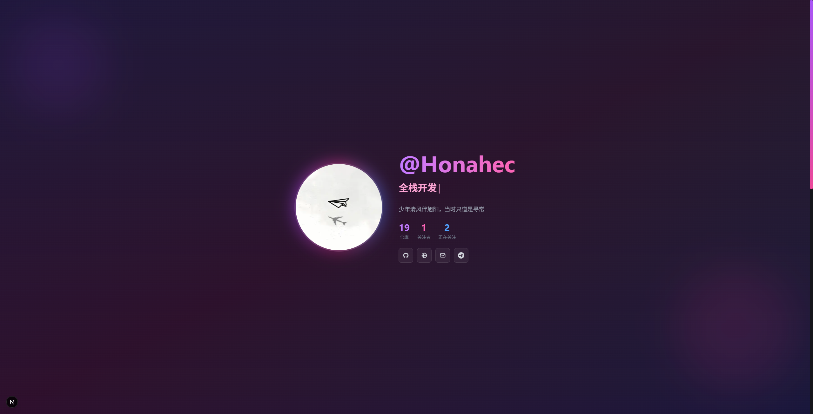

# Homepage

A minimalist Next.js personal homepage that showcases your GitHub projects and activity.



## Quick Start

### 1. Install Dependencies

```bash
pnpm install
```

### 2. Configure Environment Variables

Edit the `.env` file:

```env
# Your GitHub username (required)
NEXT_PUBLIC_GITHUB_USERNAME=your_username_here

# GitHub Token (optional, but recommended to avoid API rate limits)
# Create one here: https://github.com/settings/tokens
# Required permissions: public_repo, read:user
GITHUB_TOKEN=your_token_here
```

### 3. Run Development Server

```bash
pnpm dev
```

Open [http://localhost:3000](http://localhost:3000) in your browser to see the result.

### 4. Build for Production

```bash
pnpm build
pnpm start
```

---

Welcome Stars and PRs.
